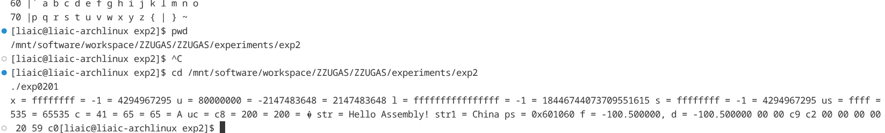
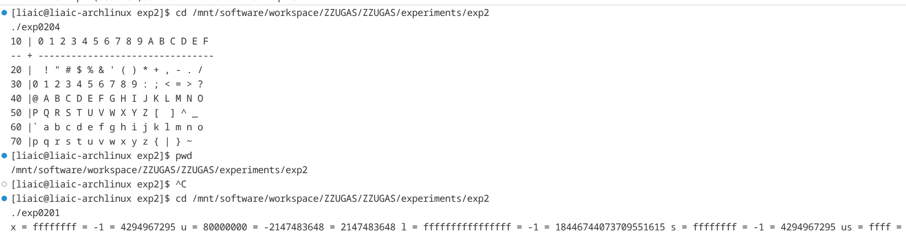

## 1. 实验报告

---

1. 记录按照实验步骤操作所得到的 **exp0201.s** 的内容。

使用命令：

```bash
cd /mnt/software/workspace/ZZUGAS/ZZUGAS/experiments/exp2
cat exp0201.s
```

`exp0201.s` 内容较长（包含调试段 `.debug_*`），正文记录其核心代码如下：

```asm
	.file	"exp0201.c"
	.intel_syntax noprefix
	.text
.Ltext0:
	.section	.rodata.str1.1,"aMS",@progbits,1
.LC0:
	.string	" %.2x"
	.text
	.globl	show_bytes
	.type	show_bytes, @function
show_bytes:
...
	.globl	main
	.type	main, @function
main:
...
	.globl	ps
	.data
	.align 8
	.type	ps, @object
	.size	ps, 8
ps:
	.quad	str
	.globl	str1
	.type	str1, @object
	.size	str1, 6
str1:
	.byte	67
	.byte	104
	.byte	105
	.byte	110
	.byte	97
	.byte	0
	.globl	str
	.align 16
	.type	str, @object
	.size	str, 16
str:
	.string	"Hello Assembly!"
	.globl	uc
	.type	uc, @object
	.size	uc, 1
uc:
	.byte	-56
	.globl	c
	.type	c, @object
	.size	c, 1
c:
	.byte	65
	.globl	us
	.align 2
	.type	us, @object
	.size	us, 2
us:
	.value	-1
	.globl	s
	.align 2
	.type	s, @object
	.size	s, 2
s:
	.value	-1
	.globl	ul
	.align 8
	.type	ul, @object
	.size	ul, 8
ul:
	.quad	-1
	.globl	l
	.align 8
	.type	l, @object
	.size	l, 8
l:
	.quad	-1
	.globl	u
	.align 4
	.type	u, @object
	.size	u, 4
u:
	.long	-2147483648
	.globl	x
	.align 4
	.type	x, @object
	.size	x, 4
x:
	.long	-1
	.globl	d
	.align 8
	.type	d, @object
	.size	d, 8
d:
	.long	0
	.long	-1067900928
	.globl	f
	.align 4
	.type	f, @object
	.size	f, 4
f:
	.long	3267952640
```

2. 记录 **exp0201** 运行结果截图。

执行命令：

```bash
cd /mnt/software/workspace/ZZUGAS/ZZUGAS/experiments/exp2
./exp0201
```

终端运行结果：

```text
x = ffffffff = -1 = 4294967295 u = 80000000 = -2147483648 = 2147483648 l = ffffffffffffffff = -1 = 18446744073709551615 s = ffffffff = -1 = 4294967295 us = ffff = 65535 = 65535 c = 41 = 65 = 65 = A uc = c8 = 200 = 200 = � str = Hello Assembly! str1 = China ps = 0x601060 f = -100.500000, d = -100.500000 00 00 c9 c2 00 00 00 00 00 20 59 c0
```

截图:


1. 用 **GDB** 观察 exp0201 中的变量，填写表 1（下表仅做格式展示，表格内容不一定正确）。

使用的 GDB 指令如下：

```bash
cd /mnt/software/workspace/ZZUGAS/ZZUGAS/experiments/exp2
gdb -q ./exp0201 \
	-ex "set pagination off" \
	-ex "break main" \
	-ex "run" \
	-ex "p/x &x" -ex "p/d x" -ex "x/4xb &x" \
	-ex "p/x &u" -ex "p/u u" -ex "x/4xb &u" \
	-ex "p/x &l" -ex "p/d l" -ex "x/8xb &l" \
	-ex "p/x &ul" -ex "p/u ul" -ex "x/8xb &ul" \
	-ex "p/x &s" -ex "p/d s" -ex "x/2xb &s" \
	-ex "p/x &us" -ex "p/u us" -ex "x/2xb &us" \
	-ex "p/x &c" -ex "p/d c" -ex "x/1xb &c" \
	-ex "p/x &uc" -ex "p/u uc" -ex "x/1xb &uc" \
	-ex "p/x &str" -ex "x/s &str" -ex "x/16xb &str" \
	-ex "p/x &str1" -ex "x/s &str1" -ex "x/6xb &str1" \
	-ex "p/x &ps" -ex "p/x ps" -ex "x/8xb &ps" \
	-ex "p/x &f" -ex "p/f f" -ex "x/4xb &f" \
	-ex "p/x &d" -ex "p d" -ex "x/8xb &d" \
	-ex "quit"
```

**表 1 exp0201 中的变量**

| 变量 | 变量起始地址 | 变量的值十进制 | 变量在内存中从低字节到高字节的存储顺序 | | | | | | | | |
| :--- | :--- | :--- | :--- | :--- | :--- | :--- | :--- | :--- | :--- | :--- | :--- |
| x | 0x60107c | -1 | ff | ff | ff | ff | | | | | |
| u | 0x601078 | 2147483648 | 00 | 00 | 00 | 80 | | | | | |
| l | 0x601070 | -1 | ff | ff | ff | ff | ff | ff | ff | ff | |
| ul | 0x601068 | 18446744073709551615 | ff | ff | ff | ff | ff | ff | ff | ff | |
| s | 0x601064 | -1 | ff | ff | | | | | | | |
| us | 0x601062 | 65535 | ff | ff | | | | | | | |
| c | 0x601061 | 65 | 41 | | | | | | | | |
| uc | 0x601060 | 200 | c8 | | | | | | | | |
| str | 0x601050 | 字符串"Hello Assembly!" | 48 | 65 | 6c | 6c | 6f | 20 | 41 | 73 | ... |
| str1 | 0x601048 | 字符串"China" | 43 | 68 | 69 | 6e | 61 | 00 | | | |
| ps | 0x601040 | 6295632(0x601050) | 50 | 10 | 60 | 00 | 00 | 00 | 00 | 00 | |
| f | 0x601088 | -100.5 | 00 | 00 | c9 | c2 | | | | | |
| d | 0x601080 | -100.5 | 00 | 00 | 00 | 00 | 00 | 20 | 59 | c0 | |

1. 在 **GDB** 修改 x 后，填写下表（下表仅做格式展示，表格内容不一定正确）。

使用的 GDB 指令如下：

```bash
cd /mnt/software/workspace/ZZUGAS/ZZUGAS/experiments/exp2
gdb -q ./exp0201 \
	-ex "set pagination off" \
	-ex "set confirm off" \
	-ex "break main" \
	-ex "run" \
	-ex "set var x=305419896" \
	-ex "p/d x" \
	-ex "x/4xb &x" \
	-ex "continue" \
	-ex "quit"
```

| 变量 | 变量起始地址 | 变量的值十进制 | 变量在内存中从低字节到到字节的存储顺序 | | | | | | | | |
| :--- | :--- | :--- | :--- | :--- | :--- | :--- | :--- | :--- | :--- | :--- | :--- |
| x | 0x60107c | 305419896 | 78 | 56 | 34 | 12 | | | | | |

1. 在 **GDB** 继续执行 exp0201，结果是什么？为什么？

继续执行后程序正常结束，且第一项输出由原来的 `x = ffffffff = -1 = 4294967295` 变成：

```text
x = 12345678 = 305419896 = 305419896
```

原因：`x` 是全局变量，`set var x=305419896` 直接改写了其内存（小端存储为 `78 56 34 12`），后续 `main` 中 `printf` 读取到的就是被修改后的值。

2. 用 **GDB** 观察 eg0216 中的变量，填写表 2。

该程序无调试类型信息，需显式强制类型转换。使用的 GDB 指令如下：

```bash
cd /mnt/software/workspace/ZZUGAS/ZZUGAS/experiments/exp2
gdb -q ./eg0216 \
	-ex "set pagination off" \
	-ex "set confirm off" \
	-ex "break main" \
	-ex "run" \
	-ex "p/x &i" -ex "p/d *(int*)&i" -ex "x/4xb &i" \
	-ex "p/x &l" -ex "p/d *(long*)&l" -ex "x/8xb &l" \
	-ex "p/x &c" -ex "p/d *(signed char*)&c" -ex "x/1xb &c" \
	-ex "p/x &f" -ex "p/f *(float*)&f" -ex "x/4xb &f" \
	-ex "p/x &d" -ex "p *(double*)&d" -ex "x/8xb &d" \
	-ex "quit"
```

**表 2 eg0216 中的变量**

| 变量 | 变量起始地址 | 变量的值十进制 | 变量在内存中从低字节到到字节的存储顺序 | | | | | | | | |
| :--- | :--- | :--- | :--- | :--- | :--- | :--- | :--- | :--- | :--- | :--- | :--- |
| i | 0x601058 | -12345 | c7 | cf | ff | ff | | | | | |
| l | 0x601050 | -1 | ff | ff | ff | ff | ff | ff | ff | ff | |
| c | 0x60104c | -1 | ff | | | | | | | | |
| f | 0x601048 | -1.0 | 00 | 00 | 80 | bf | | | | | |
| d | 0x601040 | -1.0 | 00 | 00 | 00 | 00 | 00 | 00 | f0 | bf | |

1. 用 **GDB** 观察 eg0217 中的变量，填写表 3。

该程序同样无调试类型信息，使用指针转换读取结构体成员。GDB 指令如下：

```bash
cd /mnt/software/workspace/ZZUGAS/ZZUGAS/experiments/exp2
gdb -q ./eg0217 \
	-ex "set pagination off" \
	-ex "set confirm off" \
	-ex "break main" \
	-ex "run" \
	-ex "p/x &x" \
	-ex "p/d *(int*)&x" \
	-ex "p/d *(char*)((char*)&x+4)" \
	-ex "p/d *(int*)((char*)&x+8)" \
	-ex "x/12xb &x" \
	-ex "quit"
```

**表 3 eg0217 中的变量**

| 变量 | 变量起始地址 | 变量的值十进制 | 变量在内存中从低字节到到字节的存储顺序 | | | | | | | | |
| :--- | :--- | :--- | :--- | :--- | :--- | :--- | :--- | :--- | :--- | :--- | :--- |
| x | 0x601040 | {a=-100,c=97,b=-200} | 9c | ff | ff | ff | 61 | 00 | 00 | 00 | 38... |
| x.a | 0x601040 | -100 | 9c | ff | ff | ff | | | | | |
| x.b | 0x601048 | -200 | 38 | ff | ff | ff | | | | | |
| x.c | 0x601044 | 97 | 61 | | | | | | | | |

1. 写出 **eg0204.s** 源程序，粘贴运行结果截图。

源码如下：

```asm
	.file	"exp0204.c"
	.intel_syntax noprefix
	.text
	.globl	main
	.type	main, @function
main:
.LFB23:
	.cfi_startproc
	sub	rsp, 392
	.cfi_def_cfa_offset 400
	mov	rax, QWORD PTR fs:40
	mov	QWORD PTR [rsp+376], rax
	xor	eax, eax
	movabs	rax, 3539882223192780849
	mov	QWORD PTR [rsp+288], rax
	movabs	rax, 3828116996166267424
	mov	QWORD PTR [rsp+296], rax
	movabs	rax, 4116351770431600160
	mov	QWORD PTR [rsp+304], rax
	movabs	rax, 4908997399661265184
	mov	QWORD PTR [rsp+312], rax
	mov	DWORD PTR [rsp+320], 1176519968
	mov	BYTE PTR [rsp+324], 0
	movabs	rax, 3255307721844469037
	mov	QWORD PTR [rsp+336], rax
	movabs	rax, 3255307777713450285
	mov	QWORD PTR [rsp+344], rax
	mov	QWORD PTR [rsp+352], rax
	mov	QWORD PTR [rsp+360], rax
	mov	DWORD PTR [rsp+368], 757935405
	mov	WORD PTR [rsp+372], 45
	movabs	rax, 2315167007338672178
	mov	QWORD PTR [rsp+48], rax
	movabs	rax, 2316292922882072610
	mov	QWORD PTR [rsp+56], rax
	movabs	rax, 2317418839969046566
	mov	QWORD PTR [rsp+64], rax
	movabs	rax, 2318544757056020522
	mov	QWORD PTR [rsp+72], rax
	mov	DWORD PTR [rsp+80], 3088430
	movabs	rax, 2319670675685519411
	mov	QWORD PTR [rsp+96], rax
	movabs	rax, 2320796591229968434
	mov	QWORD PTR [rsp+104], rax
	movabs	rax, 2321922508316942390
	mov	QWORD PTR [rsp+112], rax
	movabs	rax, 2323048425403916346
	mov	QWORD PTR [rsp+120], rax
	mov	DWORD PTR [rsp+128], 4137022
	movabs	rax, 2324174344032366644
	mov	QWORD PTR [rsp+144], rax
	movabs	rax, 2325300259577864258
	mov	QWORD PTR [rsp+152], rax
	movabs	rax, 2326426176664838214
	mov	QWORD PTR [rsp+160], rax
	movabs	rax, 2327552093751812170
	mov	QWORD PTR [rsp+168], rax
	mov	DWORD PTR [rsp+176], 5185614
	movabs	rax, 2328678012379213877
	mov	QWORD PTR [rsp], rax
	movabs	rax, 2329803927925760082
	mov	QWORD PTR [rsp+8], rax
	movabs	rax, 2330929845012734038
	mov	QWORD PTR [rsp+16], rax
	movabs	rax, 6782523431383146586
	mov	QWORD PTR [rsp+24], rax
	mov	WORD PTR [rsp+32], 24352
	mov	BYTE PTR [rsp+34], 0
	movabs	rax, 2333181680726061110
	mov	QWORD PTR [rsp+192], rax
	movabs	rax, 2334307596273655906
	mov	QWORD PTR [rsp+200], rax
	movabs	rax, 2335433513360629862
	mov	QWORD PTR [rsp+208], rax
	movabs	rax, 2336559430447603818
	mov	QWORD PTR [rsp+216], rax
	mov	DWORD PTR [rsp+224], 7282798
	movabs	rax, 2337685349072908343
	mov	QWORD PTR [rsp+240], rax
	movabs	rax, 2338811264621551730
	mov	QWORD PTR [rsp+248], rax
	movabs	rax, 2339937181708525686
	mov	QWORD PTR [rsp+256], rax
	movabs	rax, 2341063098795499642
	mov	QWORD PTR [rsp+264], rax
	mov	DWORD PTR [rsp+272], 2105470
	lea	rdi, [rsp+288]
	call	puts
	lea	rdi, [rsp+336]
	call	puts
	lea	rdi, [rsp+48]
	call	puts
	lea	rdi, [rsp+96]
	call	puts
	lea	rdi, [rsp+144]
	call	puts
	mov	rdi, rsp
	call	puts
	lea	rdi, [rsp+192]
	call	puts
	lea	rdi, [rsp+240]
	call	puts
	mov	rdx, QWORD PTR [rsp+376]
	xor	rdx, QWORD PTR fs:40
	je	.L2
	call	__stack_chk_fail
.L2:
	mov	eax, 0
	add	rsp, 392
	.cfi_def_cfa_offset 8
	ret
	.cfi_endproc
.LFE23:
	.size	main, .-main
	.ident	"GCC: (Ubuntu 5.4.0-6ubuntu1~16.04.12) 5.4.0 20160609"
	.section	.note.GNU-stack,"",@progbits
```

运行命令与结果：

```bash
cd /mnt/software/workspace/ZZUGAS/ZZUGAS/experiments/exp2
./exp0204
```

```text
10 | 0 1 2 3 4 5 6 7 8 9 A B C D E F
-- + --------------------------------
20 |  ! " # $ % & ' ( ) * + , - . /
30 |0 1 2 3 4 5 6 7 8 9 : ; < = > ?
40 |@ A B C D E F G H I J K L M N O
50 |P Q R S T U V W X Y Z [  ] ^ _
60 |` a b c d e f g h i j k l m n o
70 |p q r s t u v w x y z { | } ~
```

截图:


1. 总结汇编语言程序开发过程的经验体会，写出自己遇到的或感到困惑的问题等。

总结如下：

1. 先看 C 源程序再看 `.s` 文件更容易理解，特别是变量布局、结构体对齐和调用约定。
2. 通过 `x/Nxb 地址` 观察字节序最直观，能快速验证小端存储和补码表示。
3. 对无调试类型信息的可执行文件，GDB 里需要显式类型转换（如 `*(int*)&i`），否则会出现 unknown type。
4. 修改变量建议在 `break main` 后进行，程序尚未输出时修改最容易观察影响。
5. 我的困惑主要是：
   - 浮点数（二进制IEEE754）手工换算难度大，建议结合在线工具或 `printf` 双重验证；
   - 结构体填充字节（padding）在内存查看时容易误判为成员值，需要结合偏移地址分析。