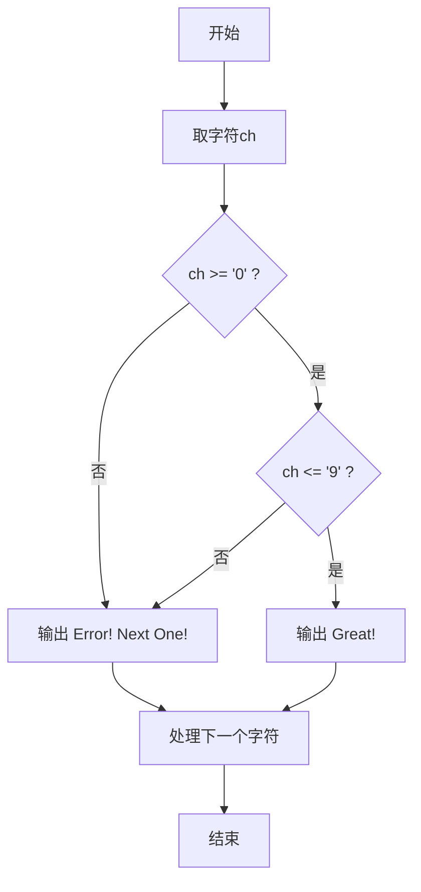
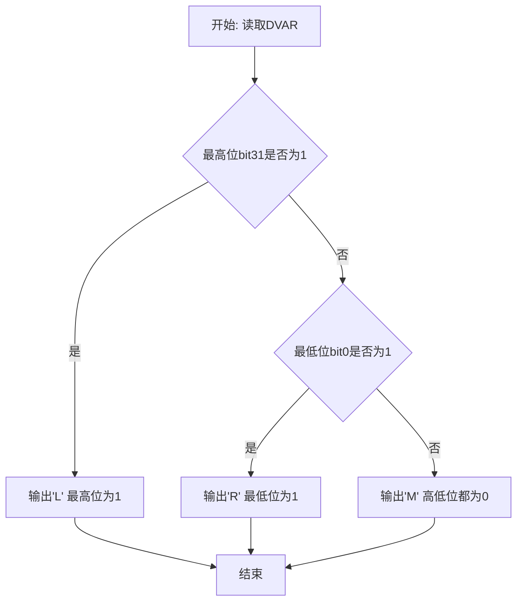

## 实验5 分支程序设计
### 一、实验目的
理解分支程序结构的特点，掌握分支结构程序的编写。
### 二、实验内容
（1）编写单分支结构的数字判断程序，并运行正确。
（2）编写双分支结构的测试高低位程序，并运行正确。
### 三、实验分析
（1）画出自己编写实现的实验内容（1）和（2）的程序流程图，
（2）给出上述两个程序的核心代码及注释。
1. 实验内容（1）单分支数字判断程序流程图（以每个字符的判断过程为例）



2. 实验内容（2）双分支测试高低位程序流程图



3. 核心代码及注释

（1）单分支数字判断（`exp0501.s`）

```asm
leaq ch1(%rip), %rax
call dispmsg                 # 显示当前待判断字符
movb ch1(%rip), %al          # 取字符
cmpb $'0', %al
jl NotNumOne                 # 小于'0'，不是数字
cmpb $'9', %al
jg NotNumOne                 # 大于'9'，不是数字
leaq correct_msg(%rip), %rax
call dispmsg                 # 在'0'~'9'之间，输出Great!
```

（2）双分支高低位测试（`exp0502.s`）

```asm
movl DVAR(%rip), %eax
andl $0x80000000, %eax
jz  label_judgeLow           # 最高位为0则继续判断最低位

movb UpOne(%rip), %al
call dispc                   # 最高位为1，输出'L'

label_judgeLow:
movl DVAR(%rip), %eax
andl $0x1, %eax
jz  label_AllZero            # 最低位为0，进入全0分支
movb LowOne(%rip), %al
call dispc                   # 最低位为1，输出'R'
```

4. 程序运行结果

（1）`exp0501` 运行输出

```text
N
Error! Next One！
a
Error! Next One！
8
Great！
```

说明：字符 `N`、`a` 不是数字，字符 `8` 是数字，判断结果正确。

（2）`exp0502` 运行输出

```text
R
```

说明：`DVAR = 0x57`，其最高位为0、最低位为1，程序进入低位分支输出 `R`，结果正确。

### 四、实验总结
（1）总结通用数据处理指令实验和分支程序设计实验，把自己迷惑不解的问题写下来，把遇到、但解决的问题总结出来。
1. 问题与解决

- 刚开始对 `cmp` 与条件跳转（`jl/jg/jz`）的配合不熟，容易把比较顺序写反。通过画“比较后标志位变化”的小表格后，分支方向就能写对。
- 在位测试中，容易把“按位与结果是否为0”与“原数对应位是否为1”混淆。使用 `and` + `jz` 的固定模板后，逻辑更清晰。
- 分支标签较多时，跳转路径容易混乱。通过统一命名（如 `NotNumOne`、`label_judgeLow`）并按“判断-处理-收尾”顺序排版，代码可读性明显提高。

对比高级语言，总结汇编语言分支程序结构的特点和编程体会。

- 高级语言用 `if/else` 描述的是结构，汇编语言用“比较+跳转”直接描述控制流，程序员必须显式管理每一条分支路径。
- 汇编分支更接近机器执行过程，效率可控，但代码抽象层次低，维护成本高。
- 编写汇编分支程序时，先画流程图再落地到标签和跳转指令，能显著减少逻辑错误。
- 条件判断通常和数据表示强相关（有符号/无符号、位掩码等），这是汇编中比高级语言更需要关注的细节。

### 五、意见及建议
回顾本课程目前已完成的各个实验项目，结合自己的完成情况，谈意见、提建议。
- 建议修改测评方式，不要只看输出，容易蒙混过关，要建立输入和输出的评测系统
- 建议提供统一的自动编译脚本参数说明（尤其是交互脚本如何批处理），方便重复实验和结果复现。
- 建议在评分标准中增加“流程图与代码一致性”项，引导从设计到实现的完整训练。


