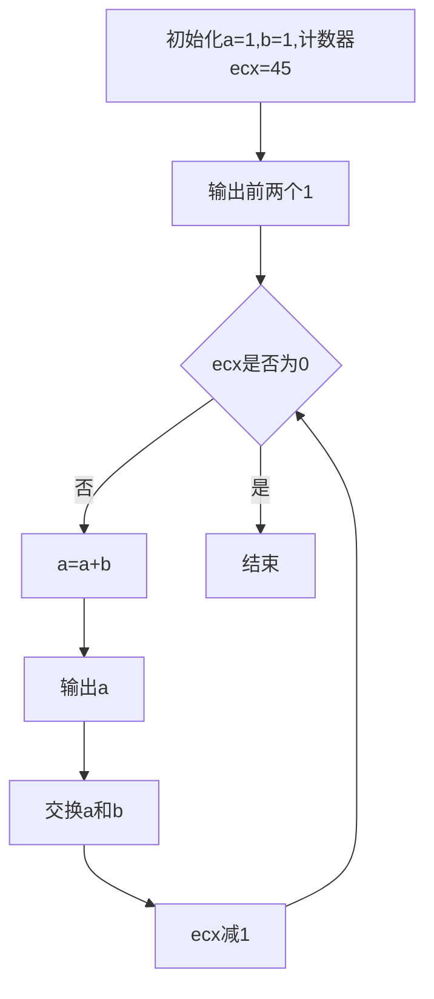
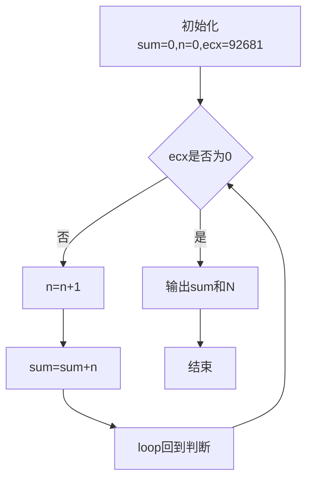
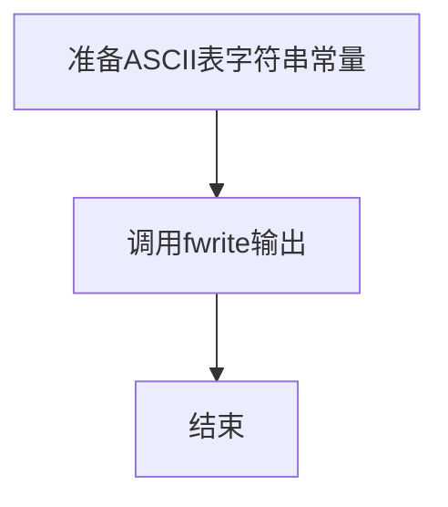

实验6 循环程序设计
实验目的
理解循环程序结构的特点，掌握循环结构程序的编写。
实验内容
编写循环结构的斐波那契数列程序，输出斐波那契数。
编写求最大N值的自然数求和程序（循环结构），具体要求是：进行自
然数相加（1＋2＋3＋……＋N），无符号整数的累加和用一个32位寄存器存
储，求出（显示）有效累加和的最大值及对应的最大N值。
编写多重循环的冒泡法排序程序，并运行正确。
编写显示ASCII表程序，并运行正确。
三、实验分析
画出自己编写实现的实验内容（1）、（2）、（3）和（4）的程序流程
图，给出核心代码、注释以及运行结果截图。
1. 实验内容（1）斐波那契数列流程图（`exp0602.s`）



2. 实验内容（2）自然数求和最大N流程图（`exp0601.s`）



3. 实验内容（3）排序程序流程图（`exp0603`）

```mermaid
flowchart TD
	A[输入数组] --> B[从i=1开始外层循环]
	B --> C[取key=a[i], j=i-1]
	C --> D{j>=0 且 a[j]>key?}
	D -- 是 --> E[a[j+1]=a[j], j--]
	E --> D
	D -- 否 --> F[a[j+1]=key]
	F --> G{i<n?}
	G -- 是 --> B
	G -- 否 --> H[输出有序数组并结束]
```

4. 实验内容（4）ASCII表显示流程图（`exp0604`）



5. 核心代码及注释

（1）斐波那契循环核心（`exp0602.s`）

```asm
movl $1, %eax
movl $1, %ebx
movl $45, %ecx

Fib:
	addl %ebx, %eax      # a = a + b
	...                  # 保存寄存器并输出当前项
	xchgl %eax, %ebx     # 交换a、b，为下一轮做准备
	loop Fib             # ecx--，非0继续
```

（2）自然数求和核心（`exp0601.s`）

```asm
xorl %eax, %eax          # sum = 0
xorl %ebx, %ebx          # n = 0
movl $92681, %ecx        # 循环次数(最大有效N)

Sum:
	incl %ebx            # n++
	addl %ebx, %eax      # sum += n
	loop Sum
```

（3）排序核心（`exp0603`，由C编译得到汇编）

```c
for (i = 1; i < n; i++) {
	key = a[i];
	j = i - 1;
	while (j >= 0 && a[j] > key) {
		a[j + 1] = a[j];
		j--;
	}
	a[j + 1] = key;
}
```

（4）ASCII表显示核心（`exp0604`）

```c
fwrite(table, 1, 289, stdout);
```

6. 程序运行结果

（1）`exp0601` 输出

```text
4294930221
92681
```

说明：在32位无符号累加范围内，最大有效累加和为 `4294930221`，对应最大 `N=92681`。

（2）`exp0602` 输出（部分）

```text
1
1
2
3
5
8
...
1134903170
1836311903
2971215073
```

说明：斐波那契序列按循环正确输出。

（3）`exp0603` 输出

```text
587
-632
777
234
-34
-632
-34
234
587
777
```

说明：前5行为原数组，后5行为升序结果，排序正确。

（4）`exp0604` 输出（节选）

```text
10 | 0 1 2 3 4 5 6 7 8 9 A B C D E F
-- + --------------------------------
20 |  ! " # $ % & ' ( ) * + , - . /
...
70 |p q r s t u v w x y z { | } ~
```

说明：ASCII可显示字符区间排版正确。


四、实验总结
（1）总结实验中出现的问题及解决方法

- 循环边界最容易出错，尤其是 `loop` 指令会自动修改 `ecx`。解决方法是先确定循环次数，再把“初始化、循环体、终止条件”分块写清。
- 斐波那契程序中输出函数调用会破坏部分寄存器，解决方法是调用前后 `push/pop` 保护现场。
- 在排序程序阅读汇编时，地址计算（如 `base + index*4`）容易混淆，通过先对照C版本再看汇编，可快速定位每条指令含义。
- ASCII表程序虽然逻辑简单，但让我理解了“循环不一定必须显式写在当前源码中”，也可以提前构造数据后一次性输出。

对比高级语言，总结汇编语言循环程序结构的特点和编程体会。

- 高级语言循环强调语义（`for/while`），汇编循环强调控制细节（计数寄存器、条件码、跳转目标）。
- 汇编循环执行路径清晰、可精确控制性能，但可读性差，维护难度高于高级语言。
- 在汇编里，循环变量、临时变量、函数调用现场都要显式管理，编程时必须养成“先设计流程图再编码”的习惯。
- 对寄存器生命周期和数据宽度（8/16/32/64位）的理解，是写对循环程序的关键。


