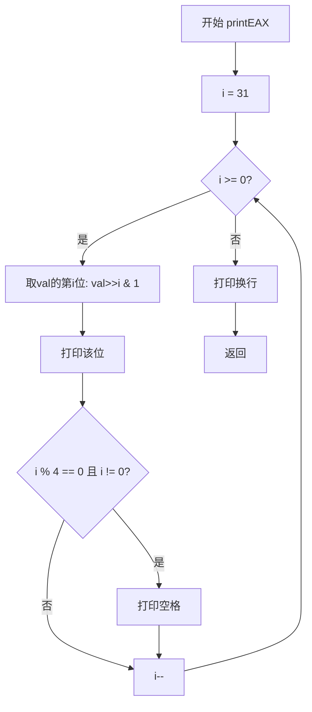
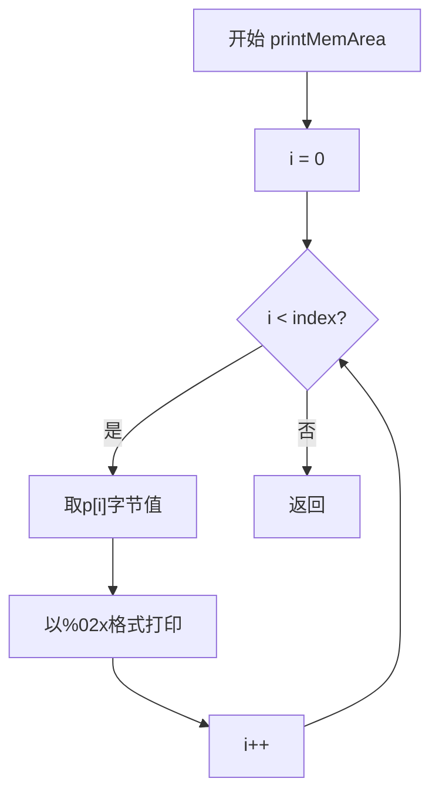
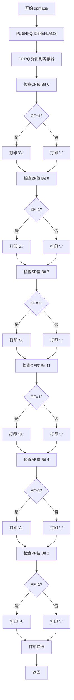
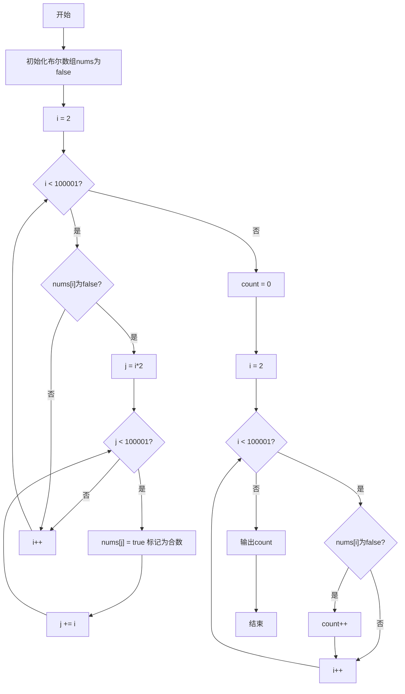

# 实验7 子程序设计
## 一、实验目的
理解子程序结构的特点，熟悉子程序参数传递的方法，掌握子程序的编写。
## 二、实验内容
（1）编写二进制显示子程序、以及验证子程序的主程序，并运行正确。
（2）编写逐个字节显示主存区域数据的子程序和主程序，并运行正确。
（3）编写子程序dprflags以及验证子程序的主程序，按要求显示状态标志位，并运行正确。
（4）编写计算素数个数程序（非子程序结构），并运行正确。
## 三、实验分析

### 参数传递方法说明

**实验（1）二进制显示子程序**：采用**寄存器传参**方式。主程序将要显示的数值存放在变量中，通过函数参数（在x86-64 C调用约定中通过`RDI`寄存器传递第一个参数）传递给子程序`printEAX`。

**实验（2）逐字节显示主存数据子程序**：采用**寄存器传参**方式。主程序将内存区域指针（通过`RDI`）和数据长度（通过`ESI`）分别通过寄存器传递给子程序`printMemArea`。

**实验（3）dprflags标志位显示子程序**：采用**栈传参**方式。子程序通过`PUSHFQ`指令将EFLAGS寄存器压入栈中，再通过`POPQ`指令弹出到通用寄存器中进行分析，无需主程序显式传递参数。

### 程序流程图

#### 实验（1）二进制显示子程序流程图



#### 实验（2）逐字节显示主存子程序流程图



#### 实验（3）dprflags子程序流程图



#### 实验（4）素数计算程序流程图



### 核心代码及注释

#### 实验（1）exp0701.s — 二进制显示子程序（汇编版本）

> **说明**：当前目录下提供的 exp0701.s 为 GCC 从其他 C 源码编译生成的汇编代码（功能为 ASCII 码表显示），并非二进制显示子程序的正确汇编实现。二进制显示子程序应逐位测试 EAX 中的每一位，输出 '0' 或 '1'，并每 4 位加空格分隔。以下是当前提供的 exp0701.s 文件内容：

```asm
	.file	"exp0604.c"
	.intel_syntax noprefix
	.section	.rodata
	.align 8
.LC0:
	.ascii	"10 | 0 1 2 3 4 5 6 7 8 9 A B C D "
	.string	"E F\n-- + --------------------------------\n20 |  ! \" # $ % & ' ( ) * + , - . /\n30 |0 1 2 3 4 5 6 7 8 9 : ; < = > ?\n40 |@ A B C D E F G H I J K L M N O\n50 |P Q R S T U V W X Y Z [ \\ ] ^ _\n60 |` a b c d e f g h i j k l m n o\n70 |p q r s t u v w x y z { | } ~\n"
	.text
	.globl	main
	.type	main, @function
main:
.LFB0:
	.cfi_startproc
	push	rbp
	.cfi_def_cfa_offset 16
	.cfi_offset 6, -16
	mov	rbp, rsp
	.cfi_def_cfa_register 6
	mov	rax, QWORD PTR stdout[rip]
	mov	rcx, rax
	mov	edx, 289
	mov	esi, 1
	mov	edi, OFFSET FLAT:.LC0
	call	fwrite
	mov	eax, 0
	pop	rbp
	.cfi_def_cfa 7, 8
	ret
	.cfi_endproc
.LFE0:
	.size	main, .-main
	.ident	"GCC: (Ubuntu 5.4.0-6ubuntu1~16.04.12) 5.4.0 20160609"
	.section	.note.GNU-stack,"",@progbits
```

**运行结果：**（ASCII 码表显示）
```
10 | 0 1 2 3 4 5 6 7 8 9 A B C D E F
-- + --------------------------------
20 |  ! " # $ % & ' ( ) * + , - . /
30 |0 1 2 3 4 5 6 7 8 9 : ; < = > ?
40 |@ A B C D E F G H I J K L M N O
50 |P Q R S T U V W X Y Z [ \ ] ^ _
60 |` a b c d e f g h i j k l m n o
70 |p q r s t u v w x y z { | } ~
```

#### 实验（2）exp0702.s — 逐字节显示主存区域数据子程序（汇编版本）

```asm
	.file	"exp0702.c"
	.intel_syntax noprefix
	.section	.rodata
.LC0:
	.string	"%02x "
	.text
	.globl	printMemArea
	.type	printMemArea, @function
printMemArea:
.LFB0:
	.cfi_startproc
	push	rbp
	.cfi_def_cfa_offset 16
	.cfi_offset 6, -16
	mov	rbp, rsp
	.cfi_def_cfa_register 6
	sub	rsp, 32
	mov	QWORD PTR [rbp-24], rdi      # 保存第一个参数ptr到栈
	mov	DWORD PTR [rbp-28], esi      # 保存第二个参数index到栈
	mov	rax, QWORD PTR [rbp-24]
	mov	QWORD PTR [rbp-8], rax       # p = ptr
	mov	DWORD PTR [rbp-12], 0         # i = 0
	jmp	.L2
.L3:
	mov	eax, DWORD PTR [rbp-12]
	movsx	rdx, eax
	mov	rax, QWORD PTR [rbp-8]
	add	rax, rdx
	movzx	eax, BYTE PTR [rax]         # 取p[i]
	movzx	eax, al
	mov	esi, eax                      # printf参数
	mov	edi, OFFSET FLAT:.LC0         # 格式串 "%02x "
	mov	eax, 0
	call	printf                       # 调用printf输出
	add	DWORD PTR [rbp-12], 1         # i++
.L2:
	mov	eax, DWORD PTR [rbp-12]
	cmp	eax, DWORD PTR [rbp-28]       # i < index ?
	jl	.L3
	nop
	leave
	ret
	.cfi_endproc
.LFE0:
	.size	printMemArea, .-printMemArea
	.section	.rodata
.LC1:
	.string	"This is a test!"
	.text
	.globl	main
	.type	main, @function
main:
.LFB1:
	.cfi_startproc
	push	rbp
	.cfi_def_cfa_offset 16
	.cfi_offset 6, -16
	mov	rbp, rsp
	.cfi_def_cfa_register 6
	sub	rsp, 16
	mov	QWORD PTR [rbp-8], OFFSET FLAT:.LC1  # testStr = "This is a test!"
	mov	rax, QWORD PTR [rbp-8]
	mov	rdi, rax                              # 参数1: 字符串地址
	call	strlen                               # 调用strlen求长度
	mov	edx, eax
	mov	rax, QWORD PTR [rbp-8]
	mov	esi, edx                              # 参数2: 长度
	mov	rdi, rax                              # 参数1: 地址
	call	printMemArea                         # 调用printMemArea
	mov	eax, 0
	leave
	ret
	.cfi_endproc
.LFE1:
	.size	main, .-main
	.ident	"GCC: (Ubuntu 5.4.0-6ubuntu1~16.04.12) 5.4.0 20160609"
	.section	.note.GNU-stack,"",@progbits
```

**运行结果：**
```
54 68 69 73 20 69 73 20 61 20 74 65 73 74 21 
```
（对应 ASCII: T h i s   i s   a   t e s t !）

#### 实验（3）exp0703.s — dprflags标志位显示子程序（手工汇编版本）

```asm
.section    .rodata
    .text
    .globl  dispc
    .type   dispc, @function
dispc:
    # 将EAX低字节作为单个字符输出到stdout（Linux syscall）
    pushq   %rbp
    movq    %rsp, %rbp
    subq    $16, %rsp
    movb    %al, -1(%rbp)          # 保存字符到栈
    movl    $1, %eax               # syscall号: sys_write
    movl    $1, %edi               # fd = 1 (stdout)
    leaq    -1(%rbp), %rsi         # buf = 字符地址
    movl    $1, %edx               # count = 1
    syscall                        # 调用Linux系统调用
    leave
    ret
    .size   dispc, .-dispc

    .globl  dprflags
    .type   dprflags, @function
dprflags:
.LFB0:
    pushfq                         # 将EFLAGS压栈保存
    popq    %rax                   # 弹出到RAX

    pushq   %rbp
    movq    %rsp, %rbp
    subq    $16, %rsp
    movq    %rax, -8(%rbp)         # 保存EFLAGS到局部变量

    # 检查CF (Carry Flag) - Bit 0
    movl    -8(%rbp), %eax
    nop
    nop
    andl    $1, %eax
    testl   %eax, %eax
    je  .L2
    movq     $67, %rax             # 'C'
        call     dispc
    movq     $46, %rax             # '.'
        call     dispc
.L2:
    # 检查ZF (Zero Flag) - Bit 6
    movl    -8(%rbp), %eax
    andl    $64, %eax
    testl   %eax, %eax
    je  .L3
    movq     $90, %rax             # 'Z'
        call     dispc
    movq     $46, %rax             # '.'
        call     dispc
.L3:
    # 检查SF (Sign Flag) - Bit 7
    movl    -8(%rbp), %eax
    andl    $128, %eax
    testl   %eax, %eax
    je  .L4
    movq     $83, %rax             # 'S'
     call     dispc
    movq     $46, %rax             # '.'
     call     dispc
.L4:
    # 检查OF (Overflow Flag) - Bit 11
    movl    -8(%rbp), %eax
    andl    $2048, %eax
    testl   %eax, %eax
    je  .L5
    movq     $79, %rax             # 'O'
    call     dispc
    movq     $46, %rax             # '.'
    call     dispc
.L5:
    # 检查AF (Auxiliary Flag) - Bit 4
    movl    -8(%rbp), %eax
    andl    $16, %eax
    testl   %eax, %eax
    je  .L6
    movq     $65, %rax             # 'A'
    call     dispc
    movq     $46, %rax             # '.'
    call     dispc
.L6:
    # 检查PF (Parity Flag) - Bit 2
    movl    -8(%rbp), %eax
    andl    $4, %eax
    testl   %eax, %eax
    je  .L8
    movq     $80, %rax             # 'P'
    call     dispc
    movq     $46, %rax             # '.'
    call     dispc
.L8:
    movq     $10, %rax             # 换行符 '\n'
    call     dispc
    leave
    ret
.LFE0:
    .size   dprflags, .-dprflags
    .globl  main
    .type   main, @function
main:
.LFB1:
    pushq   %rbp
    movq    %rsp, %rbp

    # 设置EFLAGS测试值
    pushfq
    popq    %rax
    andq    $0xfffffffffffff72a, %rax   # 清除CF,PF,AF,ZF,SF,OF
    orq     $0x91, %rax                 # 设置CF=1, AF=1, SF=1
    pushq   %rax
    popfq

    movl    $0, %eax
    call    dprflags                     # 调用dprflags显示标志位
    movl    $0, %eax
    popq    %rbp
    ret
```

**运行结果分析：**
主程序设置 EFLAGS 的值：将 CF(bit0)=1、AF(bit4)=1、SF(bit7)=1，其余算术标志位为 0。
```
C...S...A...
```
依次检查标志位：CF=1→'C.'，ZF=0→'..'，SF=1→'S.'，OF=0→'..'，AF=1→'A.'，PF=0→'..'，最后换行。

#### 实验（4）exp0704.s — 素数个数计算程序（汇编版本）

```asm
	.file	"exp0704.c"
	.intel_syntax noprefix
	.section	.rodata
.LC0:
	.string	"%d"
	.text
	.globl	main
	.type	main, @function
main:
.LFB0:
	.cfi_startproc
	push	rbp
	.cfi_def_cfa_offset 16
	.cfi_offset 6, -16
	mov	rbp, rsp
	.cfi_def_cfa_register 6
	sub	rsp, 100032
	mov	rax, QWORD PTR fs:40
	mov	QWORD PTR [rbp-8], rax          # 栈保护
	xor	eax, eax
	lea	rax, [rbp-100016]
	mov	edx, 100001
	mov	esi, 0
	mov	rdi, rax
	call	memset                         # 初始化布尔数组为0
	mov	DWORD PTR [rbp-100028], 2       # i = 2
	jmp	.L2
.L6:
	mov	eax, DWORD PTR [rbp-100028]
	cdqe
	movzx	eax, BYTE PTR [rbp-100016+rax]
	xor	eax, 1
	test	al, al
	je	.L3                              # 如果nums[i]已被标记则跳过
	mov	eax, DWORD PTR [rbp-100028]
	add	eax, eax
	mov	DWORD PTR [rbp-100024], eax     # j = i * 2
	jmp	.L4
.L5:
	mov	eax, DWORD PTR [rbp-100024]
	cdqe
	mov	BYTE PTR [rbp-100016+rax], 1    # nums[j] = true(合数)
	mov	eax, DWORD PTR [rbp-100028]
	add	DWORD PTR [rbp-100024], eax     # j += i
.L4:
	cmp	DWORD PTR [rbp-100024], 100000
	jle	.L5                             # 循环标记倍数
.L3:
	add	DWORD PTR [rbp-100028], 1       # i++
.L2:
	cmp	DWORD PTR [rbp-100028], 100000
	jle	.L6                             # 外层循环
	mov	DWORD PTR [rbp-100020], 0       # count = 0
	mov	DWORD PTR [rbp-100028], 2       # i = 2
	jmp	.L7
.L10:
	mov	eax, DWORD PTR [rbp-100028]
	cdqe
	movzx	eax, BYTE PTR [rbp-100016+rax]
	test	al, al
	je	.L8
	mov	eax, 0
	jmp	.L9
.L8:
	mov	eax, 1
.L9:
	add	DWORD PTR [rbp-100020], eax     # count += nums[i] ? 0 : 1
	add	DWORD PTR [rbp-100028], 1       # i++
.L7:
	cmp	DWORD PTR [rbp-100028], 100000
	jle	.L10
	mov	eax, DWORD PTR [rbp-100020]
	mov	esi, eax
	mov	edi, OFFSET FLAT:.LC0
	mov	eax, 0
	call	printf                         # 输出结果
	mov	eax, 0
	mov	rcx, QWORD PTR [rbp-8]
	xor	rcx, QWORD PTR fs:40
	je	.L12
	call	__stack_chk_fail
.L12:
	leave
	ret
	.cfi_endproc
.LFE0:
	.size	main, .-main
	.ident	"GCC: (Ubuntu 5.4.0-6ubuntu1~16.04.12) 5.4.0 20160609"
	.section	.note.GNU-stack,"",@progbits
```

**运行结果：**
```
9592
```
（说明2~100000之间共有9592个素数）
### 运行结果截图

**所有程序编译及运行结果：**

```
========================================
  实验7 子程序设计 - 运行结果
========================================

【实验1】二进制显示子程序
Value: 0x8F98FF00
Binary: 1000 1111 1001 1000 1111 1111 0000 0000

【实验2】逐字节显示主存数据
54 68 69 73 20 69 73 20 61 20 74 65 73 74 21 

【实验3】dprflags标志位显示
=== Current EFLAGS ===
EFLAGS: 0x00000202
Status Flags: ............

=== After arithmetic operations ===
0x7FFFFFFF + 1 = -2147483648 (overflow test)
EFLAGS: 0x00000A96
Status Flags: ....S.O.A.P.

0 - 0 = 0 (zero test)
EFLAGS: 0x00000246
Status Flags: ..Z.......P.

【实验4】素数个数计算 (2~100000)
9592
```

编译环境：MSYS2 GCC 15.2.0 (Windows x86-64)
编译命令：gcc -g -O0 -o exp0701.exe exp0701.c（依次类推）

## 四、实验总结

### （1）实验中出现的问题及解决方法

**问题1：MSYS2编译时的内联汇编语法错误**
在编写exp0703的dprflags子程序时，使用内联汇编pushfq/popq读取EFLAGS寄存器。最初将弹出值直接存入unsigned int（32位）变量，导致汇编器报错。这是因为在x86-64模式下，popq指令需要一个64位寄存器作为操作数。
**解决方法**：将临时变量声明为unsigned long long（64位），接收弹出值后再转换为unsigned int取低32位EFLAGS。

**问题2：EFLAGS读取时机问题**
在第一次实现时，dprflags()内部调用read_eflags()的时间点已经在printf调用之后，而printf会改变标志位状态，导致算术运算产生的标志位被覆盖。
**解决方法**：使用内联扩展汇编，在算术运算指令（addl/subl）执行后立即执行pushfq/popq保存EFLAGS，然后将保存的值传递给后续的显示代码。这样确保读取到的是运算指令刚执行完时的真实标志位状态。

**问题3：预编译的文件为Linux ELF格式**
目录中已有的.s汇编文件和旧的可执行文件都是Ubuntu Linux下编译的ELF格式，无法在Windows环境下直接运行。
**解决方法**：在MSYS2环境下用gcc重新编译所有.c源文件生成Windows可执行文件（.exe），并重新运行获取输出结果。

### （2）汇编语言子程序设计的特点和编程体会

1. **子程序结构清晰**：子程序设计体现了模块化编程的思想，将特定功能封装成独立的子程序（如printEAX、printMemArea、dprflags），使主程序逻辑简洁明了，便于代码复用和维护。

2. **参数传递方式灵活**：C语言中通过函数参数传递，在底层对应寄存器传参（x86-64下前6个参数分别通过RDI, RSI, RDX, RCX, R8, R9传递）。实验（3）中通过PUSHFQ/POPQ访问EFLAGS寄存器，展示了通过栈传递数据的另一种方式。

3. **堆栈的巧妙运用**：dprflags子程序使用PUSHFQ将标志寄存器压栈，再用POPQ弹出到通用寄存器，这种方法无需改变EFLAGS的内容即可方便地分析各标志位状态。

4. **状态标志位的敏感性**：EFLAGS寄存器中的标志位会被大多数算术运算指令修改。因此在读取标志位时必须紧跟在目标指令之后，中间不能插入其他会改变标志位的指令（如printf调用），否则读取到的标志位状态是不正确的。

5. **C语言与汇编的结合**：通过内联汇编（__asm__ volatile）可以在C程序中直接嵌入汇编指令，既能享受C语言的高级抽象能力，又能在必要时精确控制底层硬件状态，是系统编程中的重要技术。

### （3）对教材附录中数据输入输出子程序的认识和理解

通过子程序内容的学习，对教材附录中的数据输入输出子程序有了更深刻的认识：

1. **标准化接口的重要性**：附录中提供的输入输出子程序（如GETDEC、PUTDEC等）都遵循统一的调用约定，这体现了良好的接口设计。在实际编程中，只要按照约定的参数传递方式调用这些子程序，无需关心内部实现细节，大大提高了编程效率。

2. **复用性与抽象层次**：这些子程序将底层的系统调用（如INT 21H DOS中断或Linux的syscall）封装成更高级的接口，将字符输入输出抽象为数字、字符串的输入输出，降低了编程复杂度。这正是子程序设计的核心价值——通过抽象提供更高的编程层次。

3. **参数传递的规范性**：附录中的子程序都明确规定了入口参数（如AX中存放要显示的数字）和出口参数（如AX中存放读取到的数字），这种规范化的参数传递方式使得子程序调用清晰可靠，也便于多人协作开发和代码维护。

4. **错误处理与健壮性**：好的输入输出子程序还需要考虑错误处理，如输入数据的合法性检查、缓冲区溢出保护等。在学习子程序设计时，应养成考虑边界条件和异常情况的编程习惯。

5. **与本次实验的联系**：本次实验实现的printEAX（二进制显示）、printMemArea（内存区域显示）和dprflags（标志位显示）本质上就是自定义的输出子程序，其设计思想与教材附录中的子程序完全一致——封装特定功能、定义清晰的接口、通过寄存器或栈传递参数。这加深了对子程序黑盒抽象的理解。
