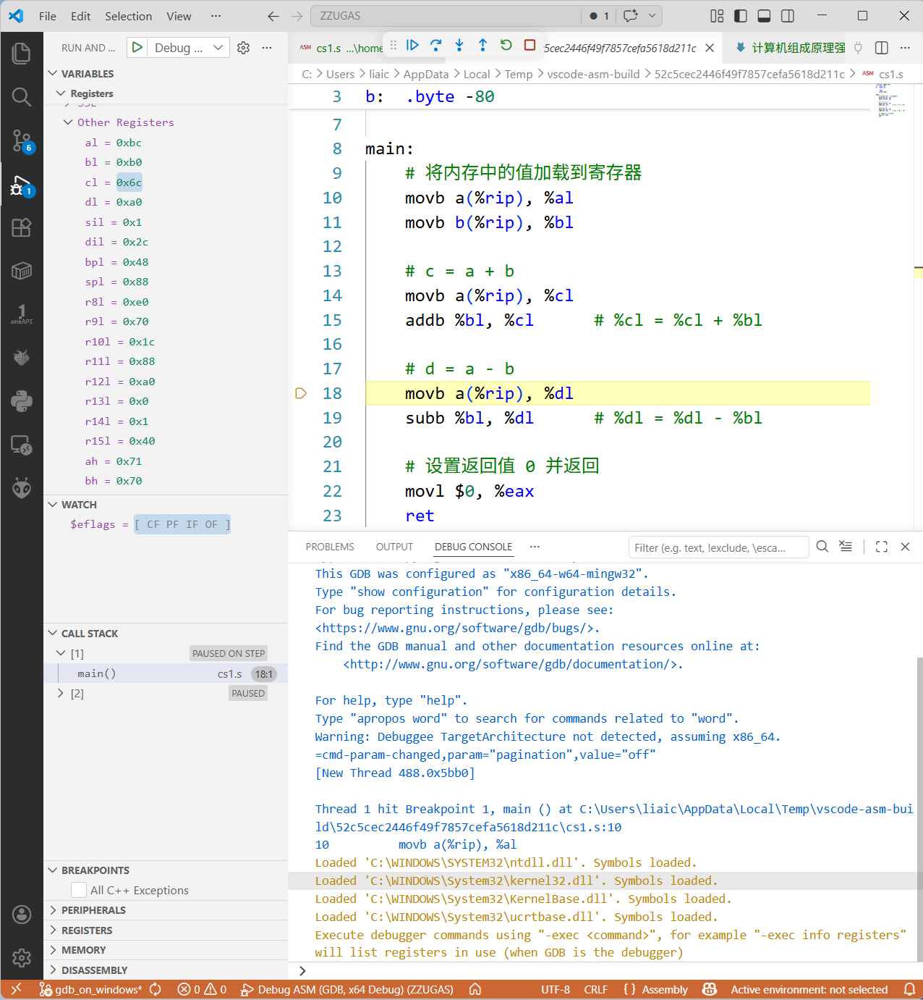
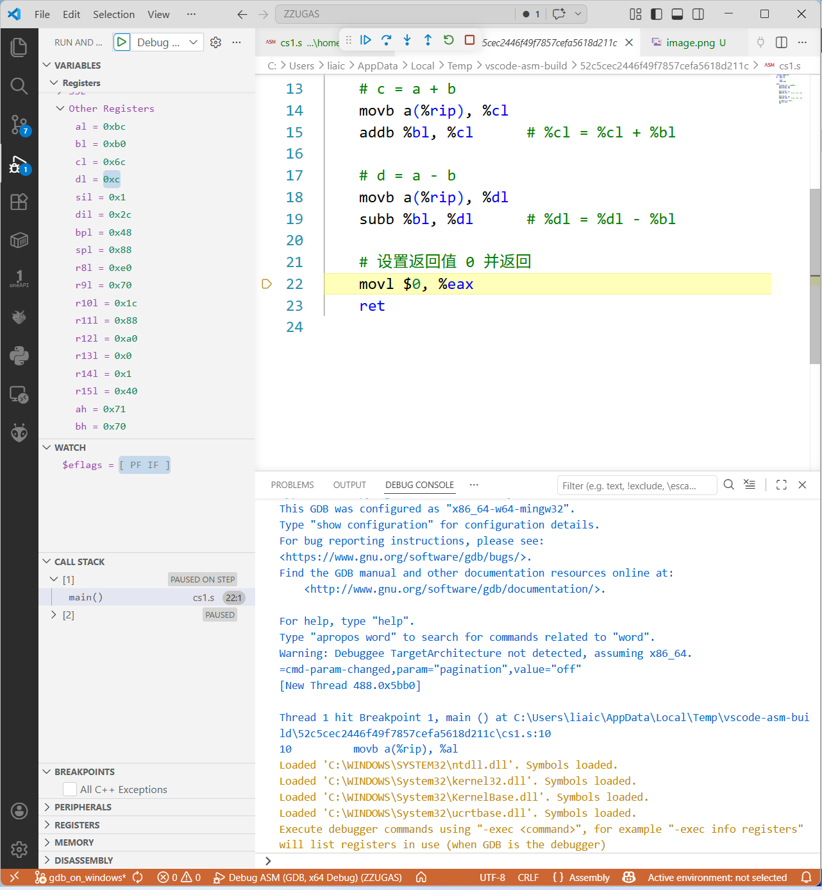
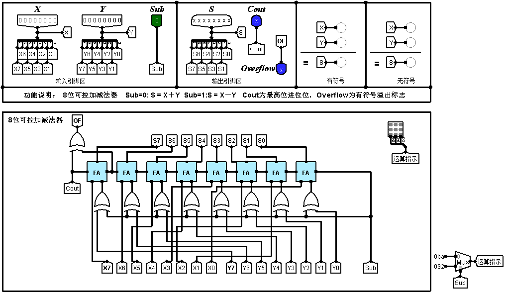

# 计算机组成原理强化课考试

某字长为8位的计算机中，带符号整数采用补码表示，$a=-68,b=-80$。$a$和$b$分别存放在寄存器$A$和$B$中(可用$A_7$~$A_0$表示寄存器A的最高位到最低位，其他寄存器类似)，请问:

## 在x86 CPU 执行结果

(1)寄存器$A$和$B$中的内容分别为?  

| 值 | %al | %bl |
| :--- | :--- | :--- |
| 存储值 | $0xbc$ | 0xb0 |
| 原码 | $-68$ | $-80$ |  

(2)若$a+b$后的结果存放在寄存器$C$中，则寄存器C的内容是什么?运算结果是否正确?此时，符号标志$SF$、溢出标志$OF$、和零标志$ZF$各是什么?加法器最高位进位$F_{out}$是什么?  
 
| %cl | SF | OF | ZF | $F_{out}$ |
| :--- | :--- | :--- | :--- | :--- |
| $0x6c$ | $0$ | $1$ | $0$ | $1$ |  

(3)若$a-b$后的结果存放在寄存器D中，则寄存器D的内容是什么?运算结果是否正确?此时，符号标志$SF$、溢出标志$OF$、和零标志$ZF$各是什么?加法器最高位进位$F_{out}$是什么?  
 
| %cl | SF | OF | ZF | $F_{out}$ |
| :--- | :--- | :--- | :--- | :--- |
| $0x6c$ | $0$ | $0$ | $0$ | $0$ |  

(4)请写出$CF$的计算公式。$CF$的含义是什么?  

**CF (Carry Flag, 进位标志位)**  
对于 $n$ 位加法 $C = A + B$，设 $a_{n-1}$ 和 $b_{n-1}$ 是两个操作数的最高位，$s_{n-1}$ 是结果的最高位，$C_{n-1}$ 是低位向最高位的进位  
  
加法:$$CF = (a_{n-1} \cdot b_{n-1}) \lor (a_{n-1} \cdot C_{n-1}) \lor (b_{n-1} \cdot C_{n-1})$$  
  
减法:$$CF = (\overline{a_{n-1}} \cdot b_{n-1}) \lor (\overline{a_{n-1}} \cdot s_{n-1}) \lor (b_{n-1} \cdot s_{n-1})$$  

(5)请画出$8bit$加法器的示意图  
